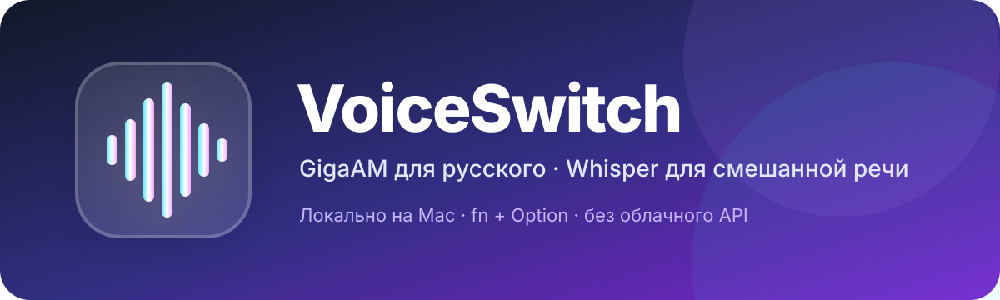

# VoiceSwitch

<p align="center">
  
</p>

> Локальная диктовка и редактура текста для macOS.

[](https://github.com/mitimaicode/VoiceSwitch/actions/workflows/ci.yml)
[](https://github.com/mitimaicode/VoiceSwitch/releases)
[](https://github.com/mitimaicode/VoiceSwitch/releases)
[](LICENSE)

VoiceSwitch записывает речь по глобальной горячей клавише, распознаёт её
полностью локально и вставляет текст в активное приложение.

- **GigaAM v3 E2E RNNT** — основной режим для русской речи;
- **Whisper Large V3 Turbo (MLX)** — для смешанной русско-английской речи;
- **Qwen3-ASR 1.7B (MLX)** — точный многоязычный режим;
- **Apple SpeechAnalyzer** — системная локальная диктовка на macOS 26+;
- **Qwen3-4B (MLX)** — локально исправляет или сокращает расшифровку;
- режимы текста **Дословно**, **Исправить** и **Кратко**;
- `fn + ⌥ Option` — начать или остановить запись;
- HUD показывает запись, расшифровку, локальную редактуру и результат;
- аудио и текст не отправляются во внешние API;
- журнал сравнения помогает выбрать модель под собственную речь.

> [!IMPORTANT]
> Это beta-релиз для Mac с Apple Silicon. Приложение пока подписано ad-hoc и
> не нотарифицировано Apple.

## Системные требования

- Mac с Apple Silicon (`M1` или новее);
- macOS 14 Sonoma или новее;
- рекомендуется 16 ГБ оперативной памяти;
- около 12 ГБ свободного места для Python, зависимостей и четырёх загружаемых моделей;
- интернет только во время первоначальной установки моделей.

## Установка

1. Откройте раздел [Releases](https://github.com/mitimaicode/VoiceSwitch/releases)
   и скачайте архив `VoiceSwitch-…-macos-arm64.zip`.
2. Распакуйте архив и перенесите `VoiceSwitch.app` в «Программы».
3. При первом запуске щёлкните приложение правой кнопкой и выберите
   **Открыть**. Подтвердите запуск beta-версии.
4. Нажмите значок VoiceSwitch в строке меню и выберите
   **Установить модели**. Загрузка занимает несколько гигабайт.
5. Разрешите доступ к микрофону. Для глобальной клавиши и автоматической
   вставки включите VoiceSwitch в
   **Системные настройки → Конфиденциальность и безопасность →
   Универсальный доступ**.

Подробности и решение типовых проблем приведены в [INSTALL.md](INSTALL.md).

## Использование

1. Выберите GigaAM, Whisper, Qwen или Apple в меню VoiceSwitch.
2. Выберите режим текста: **Дословно**, **Исправить** или **Кратко**.
3. Нажмите `fn + ⌥ Option`, чтобы начать запись.
4. Отпустите клавиши и нажмите сочетание ещё раз, чтобы остановить запись.
5. Дождитесь завершения расшифровки и, если выбран соответствующий режим,
   локальной редактуры. Текст будет вставлен в ранее активное
   окно или останется в буфере обмена, если универсальный доступ отключён.

Во время записи отображается красный пульсирующий индикатор с таймером.
Во время распознавания он сменяется индикатором модели и времени ожидания.
При обработке Qwen появляется отдельный фиолетовый индикатор «Редактирую
текст». HUD не перехватывает клики.

Режим **Исправить** сохраняет содержательные детали, но убирает слова-паразиты,
повторы и ошибки пунктуации. Режим **Кратко** превращает расшифровку в
компактное сообщение для переписки. Если редактор вернёт ошибку, VoiceSwitch
автоматически вставит исходную расшифровку.

Модель загружается лениво. При переключении предыдущая загружаемая модель
выгружается, чтобы не занимать память. Apple использует системные ресурсы
распознавания и может отдельно запросить разрешение «Распознавание речи».

## Где хранятся данные

Runtime и веса моделей:

```text
~/Library/Application Support/VoiceSwitch/Runtime
```

Журнал сравнительных тестов:

```text
~/Library/Application Support/VoiceSwitch/comparison.jsonl
```

В журнале сохраняются модель, длительность записи, время распознавания, RTF,
определённый язык, исходная расшифровка, результат локальной редактуры, её
режим и ваша оценка. Журнал остаётся на Mac. Временные аудиофайлы удаляются
после обработки.

## Результаты сравнительного теста

27 июля 2026 года четыре движка были проверены на восьми одинаковых
аудиофрагментах общей продолжительностью 209,5 секунды. В набор вошли
многоголосые рассказы, быстрый диалог, одиночный диктор, русский рок,
женский вокал, смешанный русско-английский трек и быстрый речитатив.

| Модель | Средняя задержка | Наблюдение | Рекомендуемая роль |
|---|---:|---|---|
| GigaAM v3 E2E RNNT | 0,77 с | Самый ровный и полный русский результат | Основная модель для русского |
| Whisper Large V3 Turbo | 2,52 с | Быстрый, но хуже переносит музыку и сложный вокал | Запасной режим для смешанной речи |
| Qwen3-ASR 1.7B | 19,00 с | Иногда точнее в отдельных фразах, но может переключаться на английский | Экспериментальный режим |
| Apple SpeechAnalyzer | 0,42 с | Минимальная задержка, но сильное обрезание сложного звука | Сравнение на чистой речи |

Высокая скорость Apple в этом тесте не означает высокую точность: движок
вернул только 25 слов на четырёх речевых файлах и пустой результат на всех
музыкальных примерах. Максимальная задержка Qwen достигла 36,24 секунды.

Итоговая практическая рекомендация — **GigaAM для русской диктовки и Whisper
для настоящей смешанной русско-английской речи**. Это сравнительный тест без
эталонной ручной разметки, поэтому цифры нельзя считать универсальным WER.

Подробная методика, результаты по сценариям и ограничения описаны в
[полном отчёте](benchmarks/2026-07-27/REPORT.md).

## Как выбрать модель

Проверьте модели на одинаковом наборе из 10–20 фраз:

- обычная русская диктовка;
- имена, названия продуктов и профессиональные термины;
- числа, даты и адреса;
- переключения русского и английского внутри одной фразы;
- короткие и длинные голосовые сообщения.

Публичный тест выше помогает выбрать отправную точку, но окончательную модель
лучше определять на своей речи, микрофоне, именах и рабочих терминах.

## Сборка из исходников

```zsh
git clone https://github.com/mitimaicode/VoiceSwitch.git
cd VoiceSwitch
chmod +x scripts/*.sh Resources/install_runtime.sh
./scripts/build_app.sh
```

Установка четырёх загружаемых моделей для разработки:

```zsh
./scripts/setup_models.sh
```

Создание компактного release-архива без весов моделей:

```zsh
./scripts/package_release.sh 0.3.0-beta
```

## Обратная связь

- воспроизводимые ошибки — [Issues](https://github.com/mitimaicode/VoiceSwitch/issues);
- вопросы, идеи и результаты сравнения моделей —
  [Discussions](https://github.com/mitimaicode/VoiceSwitch/discussions);
- правила участия — [CONTRIBUTING.md](CONTRIBUTING.md);
- сообщения об уязвимостях — [SECURITY.md](SECURITY.md).

История публичных показателей проекта сохраняется в
[`metrics/github-stats.json`](metrics/github-stats.json). GitHub также
показывает владельцу просмотры, источники переходов и клоны за последние
14 дней в разделе **Insights → Traffic**.

## Зависимости и лицензии

Код VoiceSwitch распространяется по лицензии MIT. Модели и движки
загружаются отдельно из исходных проектов:

- [GigaAM](https://github.com/salute-developers/GigaAM) — MIT;
- [OpenAI Whisper](https://github.com/openai/whisper) — MIT;
- [MLX Whisper](https://github.com/ml-explore/mlx-examples/tree/main/whisper);
- [Qwen3-ASR](https://github.com/QwenLM/Qwen3-ASR) — Apache-2.0;
- [mlx-qwen3-asr](https://github.com/moona3k/mlx-qwen3-asr) — Apache-2.0;
- [Qwen3-4B](https://huggingface.co/Qwen/Qwen3-4B-MLX-4bit) — Apache-2.0;
- [MLX LM](https://github.com/ml-explore/mlx-lm) — MIT;
- Apple Speech framework — системный компонент macOS;
- [uv](https://github.com/astral-sh/uv) — Apache-2.0 / MIT.

VoiceSwitch не связан с авторами перечисленных проектов.

---

<details>
<summary>English summary</summary>

VoiceSwitch is a local macOS dictation menu-bar app for Apple Silicon. It
switches between GigaAM, Whisper Large V3 Turbo, Qwen3-ASR 1.7B, and Apple
SpeechAnalyzer. A local Qwen3-4B model can clean up or shorten the transcript.
Press `fn + Option` to start or stop recording. Audio and transcripts stay on
the Mac. Apple SpeechAnalyzer requires macOS 26 or newer.
See [INSTALL.md](INSTALL.md) for installation details and use GitHub Issues or
Discussions for feedback.

</details>
